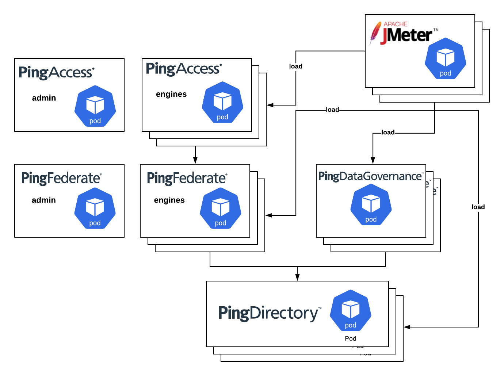
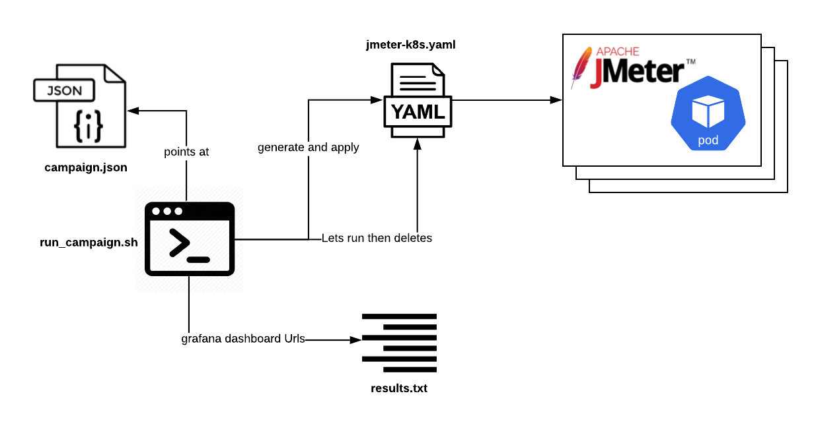

# PingIdentity Capacity Planning Framework

This contains a set of tools to test how PingIdentity Software in containers will handle provided use cases. 
Once the tools are set up, you'll be able to run load tests against your Ping stack and get dashboards of data to show how well the configuration can handle the load.

It is difficult to build a framework that is both: 1. valuable and easy to use 2. completely vendor/infrastructure agnostic. As such, this documentation is based around a specific architecture for an "easy path" approach. An appendix is provided for customizing to different use-cases or infrastructures. 

The default configuration and test suite is based on the [baseline](https://github.com/pingidentity/pingidentity-server-profiles/tree/master/baseline) server-profile with layers for clustering and [monitoring](https://github.com/pingidentity/pingidentity-server-profiles/tree/master/monitoring) on top. 

The expected infrastructure:
- AWS
  - Route53
  - EKS
    - Nginx ingress controller with AWS NLB
    - ExternalDNS


## Pre-requisites

If you want to create an EKS cluster for this excercise, follow this guide: https://github.com/pingdevopsprogram/ping-poc-base/blob/master/docs/create_eks_cluster.md. 
You can then tear it down when you're done. 

**Required**

- A Kubernetes (k8s) cluster
- Kustomize
- Helm 3 cli (used for Influxdb)
- envsubst
- Familiarity with PingIdentity containers

**Highly Recommended**

- K8s cluster is in AWS, if not, you will need to know kubernetes fairly well. 
- ping-devops tool and completed getStarted
  - highly recommended as this document will expect you have the above. 
  - If you don't you'll have to figure out how to do the same steps on your own. 
- Kubernetes knowledge - not required, but the more you know, the easier it will be. 


## Contents
[Prepare Environment]
[Deploy your tools]
  [Metrics Stack]
  []

## Prepare Environment

1. Decide on a namespace and domain that you'll use (you can use multiple namespaces if you're more familiar with k8s). Export them as variables in your current shell session. These may already be set if you use the ping-devops tool
  ```
  export PING_IDENTITY_K8S_NAMESPACE=<namespace>
  export PING_IDENTITY_DEVOPS_DNS_ZONE=<domain.com>
  ```

2. Set your chosen namespace as your current context
  ```
  kubectl config set-context --current --namespace=<insert-namespace-name-here>
  ```
  or if you have kubens
  ```
  kubens <namespace>
  ```


## Setup Metrics Stack

If you already have any of these tools installed in your cluster, you are probably familiar with the tools and you can pull configs from files in `./metrics` that are specific to Ping products. 

These instructions will install the products with defaults we have chosen. If you want to make edits to the allocated resources, look through the files. 

### InfluxDb

This is deployed with helm 3. 
InfluxDb is used to store metrics from jmeter. 


1. Create the storage class for InfluxDB
> This storage class is influxdb specific. 
```
kubectl apply -f metrics/influxdb/storageclass.yaml
```

2. Use helm to install influxdb. 

```
helm install influx -f metrics/influxdb/values.yaml stable/influxdb 
```

### Prometheus

```
envsubst '${PING_IDENTITY_K8S_NAMESPACE} ${PING_IDENTITY_DEVOPS_DNS_ZONE}' < metrics/prometheus.yaml | kubectl apply -f -
```
> Note, this requires admin access in the cluster

### Grafana

```
envsubst '${PING_IDENTITY_K8S_NAMESPACE} ${PING_IDENTITY_DEVOPS_DNS_ZONE}' < metrics/grafana.yaml| kubectl apply -f -
```

## Set Up PingIdentity Stack

The stack is prepared to use a default configuration.
This makes it so you can choose the exact capacity you want to test. 



1. open `./ping/kustomization.yaml` in a text editor. Decide on the products you want to use. Then comment out everything relating to the rest. But, the products have dependencies on each other based on the diagram above. PF/PDG need PD, PA needs PF. 
As an example, if you want to test PingFederate and PingDirectory, you would comment out the other products in the resources section and everything for those products in the patches section. Leave the resources that aren't product specific


2. for the products you're testing, look through and edit the respective `patches:` to specify the number of instances (replicas) and resources you want per instance. 

3. once you're ready deploy: 
```
kustomize build ping | envsubst '${PING_IDENTITY_K8S_NAMESPACE} ${PING_IDENTITY_DEVOPS_DNS_ZONE}' | kubectl apply -f -
```

## Generate Load



Traffic in this framework is generated with Jmeter. Similar to performance testing frameworks, with this framework you have the ability to run a sequence of various tests and load to see how your Ping stack would handle it. The tools you need are found in [generate-load](./generate-load). 

The [recommended template](./campaigns/tests-recommended-template.json) has some tests that we use. You can open [./generate-load/jmeter-jmx/instance/bin/ping-perf-framework.jmx](./generate-load/jmeter-jmx/instance/bin/ping-perf-framework.jmx) to see what other tests are available and how they are configured.  

Let's kick off a campaign to see if everything is stood up correctly:
1. Replace any variables, noted like `${VARIABLE_NAME}`, with what makes sense for your environment
2. `cd generate-load`
3. run:
  ```
  ./run_campaign.sh --campaign campaigns/tests-recommended-template.json --results results/initial-template-test.txt --iterations 1
  ```
This script will run in the foreground. If you cancel it with `ctrl+c` before it completes, you may have jmeters still running. If this happens, you can run:
  ```
    for i in $(kubectl get deploy --template '{{range .items}}{{.metadata.name}}{{"\n"}}{{end}}' | grep jmeter) ; do kubectl delete deploy ${i} ; done
  ```

4. Once some tests complete, look at the results file

## Appendix

### AWS
AWS specific things:
  - load balancer - used with Nginx ingress controller. 
  - route53 DNS - used with externalDNS via nginx ingress controller. 
**EKS** 
  - storage class - used for influxDB and PingDirectory. 

### Nginx Ingress controller 

This appendix is meant to help folks that try to adopt this framework into a different infrastructure. 
Once your infrastructure is set up, you can follow the rest of the documentation ignoring parts that are covered here. 
customizations are broken down by tool. 

### InfluxDB

There is nothing specific to Ping on this install, if you already have influxdb, just add a jmeter db.
If you want to customize the resources allocated to influxdb, such as storage, CPU, or memory, edit `metrics/influxdb/values.yaml` first.

## Prometheus
If you already have promethues, just pull relevant scrape configs from `metrics/prometheua
Grafana will be pre-populated with some read-only dashboards that can be used for the tests. if you want to 

## Grafana

Grafana will have some dashboards built in for the framework, you cannot edit these dashboards since they are "provisioned". 
To edit the dashboard, export the json from one and import it as a new dashboard. 

## Jmeter

Jmeter is where the most customization can happen in this toolset. As such, the tools in `generate-load` are set to account for at least some of it. However, there is very tight coupling between campaign.json, run_campaign.sh, xrate.yaml, and the .jmx. So, below are some pointers when customizing each


### campaign.json

It's best to copy then edit the `tests-recommended-template.json`. The template is separated in two logical sections: 1. the initial campaign wide variables, and 2. an array of tests that will run sequentially. 

The campaign wide variables are directly mapped in `run_campaign.sh` which then fills those variables in on a corresponding `xrate.yaml`. So if you need to add a variable here, you also need to add it in run_campaign and the xrate.yaml. 

The main area to edit is the array of tests. You should be able to see a pattern in the template.

| Key  | Description  |
|---|---|
| id  | what will be used to identify this test in results.txt  |
| threadgroups  | jmeter deployments that will be made  |
| name | the jmeter threadgroup from the jmx that will be run  |
| vars  | resource configs specific to the deployment  |
| replicas  | number of jmeter pods  |
| threads  | number of jmeter threads. so (total-threads=threads * replicas)  |
| heap  | memory heap each pod will use  |
| cpus  | cpus allocated to each pod  |
| mem  | total memory allocated to each pod  |

### xrate.yaml

This is a template file that is populated from run_campaign.sh

The main thing to understand here is that it's using the pingidentity/apache-jmeter image, and the way you pass parameters to jmeter is via the `STARTUP_FOREGROUND_OPTS` environment variable. 

If you want to customize this, it may be easier to pull a completed yaml from `generate-load/yamls/tmp` when run_campaign.sh is running. Then you can see what it looks like and edit as necessary. 

Additional note. 
The recommended template will tell jmeter to hit the service that fronts pods. This is what regular user traffic will look like, it will be a bit unbalanced on the backend pods because the Kubernetes service acts as a load balancer. There is a notion of a "pure" test will tell jmeter to send load to pods directly. "Pure" tests have additional requirements:
  1. To have ordered numbering - the application receiving load must be a statefulset. 
  2. To have even load - the number of jmeter instances must divisible by the number of replicas in the statefulset

### run_campaign.sh
This is the script that runs everything. too much to explain for customizing. 🙃

### .jmx 

If you want to stick with the framework and use a different test than the examples provided, use the sample .jmx as a guide. 
These are the patterns you must follow from sample .jmx:

  - each tast case is a threadgroup
  - threadgroup/test names are one word all lower case
  - in order to have a non-gui jmeter run just one threadgroup, the number of threads, duration, startup delay etc are all parameters that can be sent in via command line. 


