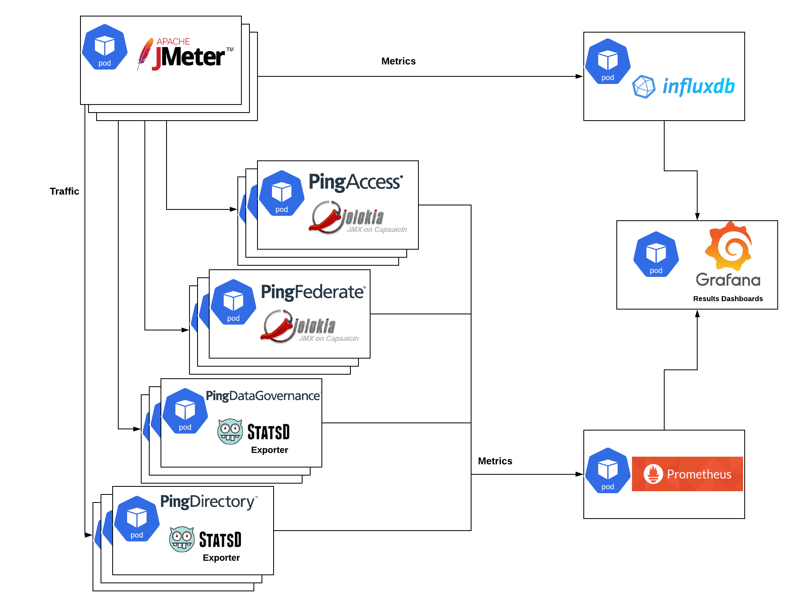
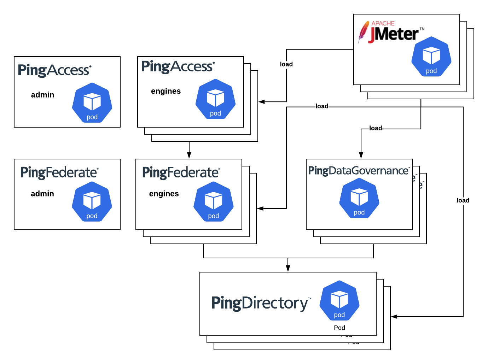
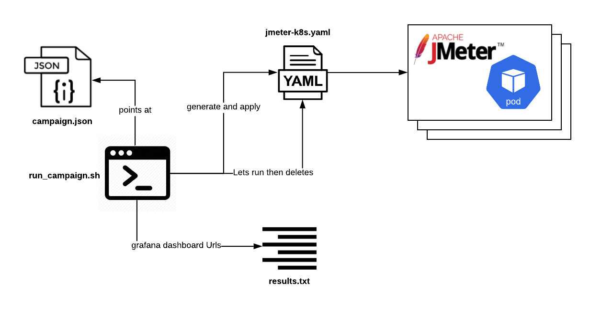
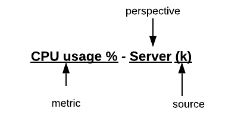
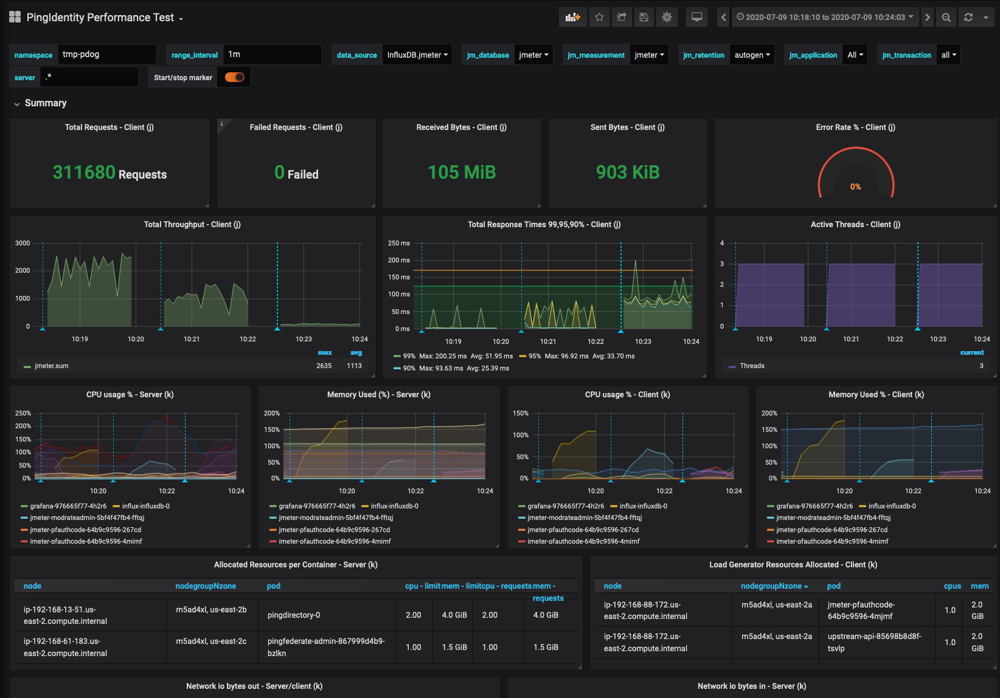

# PingIdentity Capacity Planning Framework



This contains a set of tools to test how PingIdentity Software in containers will handle provided use cases. 
Once the tools are set up, you'll be able to run load tests against your Ping stack and get dashboards of data to show how well the configuration can handle the load.

It is difficult to build a framework that is both: 1. valuable and easy to use 2. completely vendor/infrastructure agnostic. As such, this documentation is based around a specific architecture for an "easy path" approach. The initial steps will deploy everything without public hostnames, and **without any persistence**. This also makes it fairly provider agnostic. 
An appendix is provided for customizing to different use-cases or infrastructures. 


The default configuration and test suite is based on the [baseline](https://github.com/pingidentity/pingidentity-server-profiles/tree/master/baseline) server-profile with layers for clustering and [monitoring](https://github.com/pingidentity/pingidentity-server-profiles/tree/master/monitoring) on top. 


## Pre-requisites

If you want to create an EKS cluster for this excercise, follow this guide: https://github.com/pingdevopsprogram/ping-poc-base/blob/master/docs/create_eks_cluster.md. 
You can then tear it down when you're done. 

**Required**

- A Kubernetes (k8s) cluster
- Kustomize `brew install kustomize`
- Helm 3 cli (used for Influxdb)
  ```
  brew install helm
  helm repo add stable https://kubernetes-charts.storage.googleapis.com/
  ```
- envsubst
  ```
  brew install gettext
  brew link --force gettext 
  ```
- Familiarity with PingIdentity containers

**Highly Recommended**

- K8s cluster is in AWS, if not, you will need to know kubernetes fairly well. 
- ping-devops tool and completed getStarted
  - highly recommended as this document will expect you have the above for familiarity and environment config. 
  - If you don't you'll have to figure out how to do the some steps on your own. 
- Kubernetes knowledge - not required, but the more you know, the easier it will be. 


## Contents

- [Prepare Environment](#prepare-environment)
- [Deploy Metrics Stack](#set-up-metrics-stack)
- [Deploy Ping Identity Stack](#set-up-pingidentity-stack)
- [Generate Load](#generate-load)
- [Grafana Dashboards](#grafana-dashboards)
- [Provided Tests]()
- [Appendix](#appendix)
- [Roadmap](#roadmap)


## Prepare Environment

1. Decide on a namespace and domain that you'll use (you can use multiple namespaces if you're more familiar with k8s). Export them as variables in your current shell session. These may already be set if you use the ping-devops tool

  ```
  export PING_IDENTITY_K8S_NAMESPACE=<namespace>
  export PING_IDENTITY_DEVOPS_DNS_ZONE=<domain.com>
  ```
  > Note: even if you don't plan to make ingresses, just do this for clarity. 

  PING_IDENTITY_DEVOPS_DNS_ZONE it's should be set similar to: `<prefix>.<domain>`
  example: devops-program.ping-devops.com because the ingress url will then be `pingfederate-devops-program.ping-devops.com`. This makes it easier for openssl wildcard certs that cannot handle multiple `*` prefixes.


2. Set your chosen namespace as your current context
  ```
  kubectl config set-context --current --namespace=<insert-namespace-name-here>
  ```
  or if you have kubens
  ```
  kubens <namespace>
  ```


## Set Up Metrics Stack

If you already have any of these tools installed in your cluster, you are probably familiar with the tools and you can just pull relevant configs from files in `./metrics`. 

These instructions will install the products with defaults we have chosen. If you want to make edits to the allocated resources, look through the [appendix](#appendix)

> **IMPORTANT**: The defaults do not deploy any persistence or ingresses. This is to force less decisions and configuration up-front, but if you tear down your stack you will lose everything. 

### InfluxDb

Deployed with helm 3. 
InfluxDb is used to store metrics from jmeter. 

```
helm install influx -f metrics/influxdb/values.yaml stable/influxdb 
```

### Prometheus

```
kustomize build metrics/prometheus | \
   envsubst '${PING_IDENTITY_K8S_NAMESPACE} ${PING_IDENTITY_DEVOPS_DNS_ZONE}' | \
  kubectl apply -f -
```
> Note, this potentially requires admin access in the cluster. If you are internal to Ping, or using one of our clusters and see a 'forbidden' error regarding 'clusterroles': as long as `kubectl get clusterrole prometheus` returns the role, you are okay. 

To get to Prometheus' UI
```
kubectl port-forward svc/prometheus 9090:9090
```
then navigate in your browser to `http://localhost:9090

### Grafana

```
kustomize build metrics/grafana | \
envsubst '${PING_IDENTITY_K8S_NAMESPACE} ${PING_IDENTITY_DEVOPS_DNS_ZONE}' | \
kubectl apply -f -
```
To get to Grafana's UI
```
kubectl port-forward svc/grafana 3000:3000
```
then navigate in your browser to `http://localhost:3000

log in with:
admin/2FederateM0re

## Set Up PingIdentity Stack

The stack is prepared to use a default resource and server configuration, but allows to configure how much capacity to allocate. 



> Note: PingAccess is not yet added to the stack. this is a placeholder

1. open `./ping/kustomization.yaml` in a text editor. Decide on the products you want to use. Then comment out everything relating to the rest. But, with the baseline profile, the products have dependencies on each other based on the diagram above. PF/PDG need PD; PA needs PF. 
As an example, if you want to test PingFederate and PingDirectory, you would comment out the other products in the resources section and everything for those products in the patches section. Leave the resources that aren't product specific


2. for the products you *are* testing, look through `ping/kustomization.yaml` and edit the respective `patches` to specify the number of instances (replicas) and resources (CPU/Mem) you want. 

3. Ping products need licenses. The easiest way is to let containers pull licences at startup. To do this in kubernetes, just have your devops user and key in a kubernetes secret. 

  ```
  ping-devops generate devops-secret | k apply -f -
  ```
  or
  ```
  kubectl create secret generic devops \  
    --from-literal=PING_IDENTITY_DEVOPS_USER='<PING_IDENTITY_DEVOPS_USER>' \
    --from-literal=PING_IDENTITY_DEVOPS_KEY='<sPING_IDENTITY_DEVOPS_KEY>' 
  ```


4. once you're ready deploy: 
```
kustomize build ping \
  | envsubst '${PING_IDENTITY_K8S_NAMESPACE} ${PING_IDENTITY_DEVOPS_DNS_ZONE}' \
  | kubectl apply -f -
```

## Generate Load



Traffic in this framework is generated with Jmeter. Similar to performance testing frameworks, with this framework you have the ability to run a sequence of various tests and load to see how your Ping stack would handle it. The tools you need are found in [generate-load](./generate-load). 

The [recommended template](./campaigns/tests-recommended-template.json) has some tests that we use. You can open [./generate-load/jmeter-jmx/instance/bin/ping-perf-framework.jmx](./generate-load/jmeter-jmx/instance/bin/ping-perf-framework.jmx) to see what other tests are available and how they are configured.  

Let's kick off a campaign to see if everything is stood up correctly:
1. `cd generate-load`
2. Replace any variables, noted like `${VARIABLE_NAME}`, with what makes sense for your environment, or have those variables exported in your terminal. 
3. run:
  ```
  ./run_campaign.sh --campaign campaigns/tests-recommended-template.json --results results/initial-template-test.txt --iterations 1
  ```
This script will run in the foreground. If you cancel it with `ctrl+c` before it completes, you may have jmeters still running. If this happens, you can run:
  ```
    for i in $(kubectl get deploy --template '{{range .items}}{{.metadata.name}}{{"\n"}}{{end}}' | grep jmeter) ; do kubectl delete deploy ${i} ; done
  ```

4. Once some tests complete, look at the results file `results/initial-template-test.txt`. This will point you to a dashboard on grafana that was generated during the campaign. Note, so far, Grafana probably doesn't have an ingress, and so it's only accessible via kubectl port-forward. This isn't very good because Grafana makes a lot of calls from browser to server. Still, you can access it with: 
```
kubectl port-forward svc/grafana 3000:3000
```
then navigate in your browser to `http://localhost:3000/d/pingperf/...`

## Grafana Dashboards

The dashboards that come with the deployment are described here. 
> These dashboards cannot be edited directly. To edit, you have to export the dashboard.json and import it as a new dashboard. 

Metrics included on dashboards are inherently related to the use case, so there are a variety of dashboards to focus on relevant data. But, results and metrics are dashboard agnostic. As such, when you run a test and results are populated into a file, the dashboard url is simply a concatenation of: 1. the host you provide, 2. the dashboard uid you provide, and 3. the time boundaries which the test ran within. So, if you want to see the results of your test on a different dashboard, keep the `from=<time>&to=<time>` parameters from the test and change the dasboard uid sample URL: https://<host>/d/<dashboard_uid>/pingdatagovernance-performance-test-r-w?orgId=1&from=<epoch_time>&to=<epoch_time>
 
Explanations of the dashboards will go from least panels to most.
To validate that metrics are accurate, the dashboards aim to show the same metric collected and displayed from multiple perspectives and sources.  In our scenario our metrics are made up of: 
  - Perspectives - 1. "client" generating the traffic, and 2. the target "server" that is handling the traffic. 
  - Sources - 1. Kubernetes (k) Resource metrics from the metrics API 2. Jmeter (j) metrics 3. Metrics collected from PingIdentity (p) products. 

For clarity, panel/graph titles are designed as such: <metric> - <perspective> (<source>). Example: 



### PingIdentity Performance Dashbaord



Least amount of metrics, works with most use cases.

This dashboard focuses on resource metrics from Kubernetes and throughput metrics from Jmeter. 

## Appendix
This appendix is meant to help folks that try to adopt this framework into a different infrastructure. 
Once your infrastructure is set up, you can follow the rest of the documentation ignoring parts that are covered here. 
customizations are broken down by tool. 

### AWS
AWS specific things:
  - load balancer - used with Nginx ingress controller. 
  - route53 DNS - used with externalDNS via nginx ingress controller. 
**EKS** 

**Persistence**

We need to talk about persistence if you: 
  - want to save your metrics and dashboards, or 
  - need to provision external storage because the EKS nodes don't have enough. 
In EKS for this you'll create a "StorageClass" that has an AWS EBS provisioner. Our examples use the default 

_gp2 storage class_ - can be used for promethues, influxDB, grafana and PingDirectory. 
this storage class likely already exists and is default on your EKS cluster. check with :
  
  ```
  kubectl get storageclass gp2 -o=yaml
  ```

  If it doesn't, you can create it with: 
  ```
  cat <<EOF | kubectl apply -f -
  apiVersion: storage.k8s.io/v1
  kind: StorageClass
  metadata:
    name: gp2
  parameters:
    fsType: ext4
    type: gp2
  provisioner: kubernetes.io/aws-ebs
  reclaimPolicy: Delete
  volumeBindingMode: WaitForFirstConsumer
  EOF
  ```

  > How to turn on persistence for each tool will be covered in it's respective section below. 


### Nginx Ingress controller 
Certain tools have an ingress option available. Ingresses are **not** needed for this infrastructure because all load is generated from within the cluster and any tool that has a UI can be connected to using [kubectl port-forward](https://kubernetes.io/docs/tasks/access-application-cluster/port-forward-access-application-cluster) like so:

```
kubectl port-forward pod/<pod-name> <port-on-host>:<port-on-pod>
```

> Note, single-page apps don't do as well on port-forwards. Grafana is _very_ chatty in it's interface so you probably want to set up an ingress for this. 

General ingress notes:

  - If the tool does have an ingress, you'll see a commented out section on the corresponding `kustomization.yaml`.

  - The base infrastructure expects nginx used as the ingress controller with `nginx-publix` as the class. This means, the ingresses have an annotation like so:
    ```
      annotations:
        kubernetes.io/ingress.class: nginx-public
    ``` 
      - You'd have to change this on each ingress.yaml file if you want to use a different ingress class. 
      - you can get the  `ingress-class` from  `.spec.template.spec.containers.[0].args` of your nginx ingress controller deployment. depending on how yours is set up, you can use something like this
        ```
        k get deploy nginx-ingress-controller -n ingress-nginx-public -o=yaml | grep '--ingress-class'
        ```

  - Each of the ingresses leverage a secret, `tls-secret`, that should contain the cert and private key for a domain. You can create an openssl version with the ping-devops tool:
    ```
    ping-devops generate tls-secret '<domain.com>' | kubectl apply -f -
    ```

  - **Additionally, Ping Identity Clusters**: our clusters are integrated with AWS Route53 via externalDNS. This means if you use a domain that we own in Route53, your host will automatically be published externally. Reach out to find which domain you can use. This means to get a public host for your tool, all you should have to to is: 
    1. uncomment the `ingress.yaml` on `kustomization.yaml`
    2. make sure you have a `tls-secret` for your domain. Create it with ping-devops tool or get one from Confluence. 

### InfluxDB

There is nothing specific to Ping on this install, if you already have influxdb, just add a jmeter database.

All customizations for this influxdb (persistence, CPU, memory, etc) are found in `metrics/influxdb/values.yaml`.
edit this file before running the helm command 

## Prometheus
If you already have promethues, just pull relevant scrape configs from `metrics/prometheua
Grafana will be pre-populated with some read-only dashboards that can be used for the tests. if you want to 

**Persistence**
To save the metrics you collect on prometheus:
1. decide how much `storage` you want to allocate to it on: `metrics/prometheus/persistence-pvc.yaml`
2. uncomment the corresponding lines on `metrics/prometheus/kustomization.yaml` and reapply with:
  ```
  kustomize build . | envsubst '${PING_IDENTITY_K8S_NAMESPACE} ${PING_IDENTITY_DEVOPS_DNS_ZONE}' | kubectl apply -f -
  ```

Additionally if you need to edit how long data is retained on prometheus, this can be configured on the `metrics/prometheus/kustomization.yaml` in the `patches` section. Edit the args that are passed to prometheus with how much disk to use for retention and how many days.

## Grafana

Grafana will have some dashboards built in for the framework, you cannot edit these dashboards since they are "provisioned". 
To edit the dashboard, export the json from one and import it as a new dashboard. 

**Persistence**
You may edit dashboards in grafana and be weary of losing those dashboards.. To save this:
  1. decide how much `storage` you want to allocate to it on: `metrics/grafana/persistence-pvc.yaml`
  2. uncomment the corresponding lines on `metrics/grafana/kustomization.yaml` and reapply with:
    ```
    kustomize build metrics/grafana | envsubst '${PING_IDENTITY_K8S_NAMESPACE} ${PING_IDENTITY_DEVOPS_DNS_ZONE}' | kubectl apply -f -
    ```

Once you've actually run a campaign, what's more important is saving the results of your campaigns. There's no easy, automated way to do this that beats the UI. So, to so save a campaign, or a single test from a campaign: 
  1. pull the URL from the results file that came out of your campaign, this should take you to a dashboard in your browser. 
  2. click the share icon at the top of the dashbaord. then Snapshot. save it to local. 
  3. then you can find this snapshot in the left menu `Dashboards`>`Snapshots`. This shows the snapshot ID/key
  4. if you really want to save it, then pull the snapshot's json data from the grafana api: 
    1. create an API key: `settings`>`API Keys`
    2. then `curl` the snapshot API
      ```
      curl --location --request GET 'https://${grafanaHost}/api/dashboards/uid/${uid}' \
        --header 'Content-Type: application/json' \
        --header 'Accept: application/json' \
        --header 'Authorization: Bearer ${apiKey}'
      ```
    3. this json can be used to create a snapshot in a different grafana: 
      <!-- TODO: validate this -->
      ```
      curl --location --request POST 'https://${grafanaHost}/api/snapshots' \
        --header 'Authorization: Bearer ${apiKey}' \
        --header 'Content-Type: application/json' \
        --data @import.json
      ```
      <!-- TODO: FINISH THIS SCRIPT! -->
    > Additionally, there is a script coming, `bulk_snapshots.sh`, for bulk exporting/importing snapshots. 

**External host**
If you've followed the steps in [Nginx Ingress controller](#nginx-ingress-controller) then just uncomment ingress.yaml in `metrics/grafana/kustomization.yaml` and reapply with:
  ```
  kustomize build metrics/grafana | envsubst '${PING_IDENTITY_K8S_NAMESPACE} ${PING_IDENTITY_DEVOPS_DNS_ZONE}' | kubectl apply -f -
  ```

## Jmeter

Jmeter is where the most customization can happen in this toolset. As such, the tools in `generate-load` are set to account for at least some of it. However, there is very tight coupling between campaign.json, run_campaign.sh, xrate.yaml, and the .jmx. So, below are some pointers when customizing each


### campaign.json

It's best to copy then edit the `tests-recommended-template.json`. The template is separated in two logical sections: 1. the initial campaign wide variables, and 2. an array of tests that will run sequentially. 

The campaign wide variables mapped in `run_campaign.sh` which then fills those variables in on a corresponding `xrate*.yaml.susbt`. So if you need to add a variable here, you also need to add it in run_campaign and the xrate.yaml. 

- If `.jmeterProperties` contains key-value pairs they are converted to jmeter command-line properties and passed to the jmeter script. This is in addition to what is already passed in `.spec.template.spec.containers.0.env` name:`SERVER_FOREGROUND_OPTS`. There you will see `${JMETER_PROPERTIES}`

The main area to edit is the array of tests. You should be able to see a pattern in the template.

| Key  | Description  |
|---|---|
| id  | what will be used to identify this test in results.txt  |
| threadgroups  | jmeter deployments that will be made  |
| jmeterProperties  | similar to campaign-wide properties, but applied only on one deployment  |
| name | the jmeter threadgroup from the jmx that will be run  |
| vars  | resource configs specific to the deployment  |
| replicas  | number of jmeter pods  |
| threads  | number of jmeter threads. so (total-threads=threads * replicas)  |
| heap  | memory heap each pod will use  |
| cpus  | cpus allocated to each pod  |
| mem  | total memory allocated to each pod  |

### xrate.yaml

This is a template file that is populated from run_campaign.sh

The main thing to understand here is that it's using the pingidentity/apache-jmeter image, and the way you pass parameters to jmeter is via the `STARTUP_FOREGROUND_OPTS` environment variable. 

If you want to customize this, it may be easier to pull a completed yaml from `generate-load/yamls/tmp` when run_campaign.sh is running. Then you can see what it looks like and edit as necessary. 

Additional note. 
The recommended template will tell jmeter to hit the service that fronts pods. This is what regular user traffic will look like, it will be a bit unbalanced on the backend pods because the Kubernetes service acts as a load balancer. There is a notion of a "pure" test will tell jmeter to send load to pods directly. "Pure" tests have additional requirements:
  1. To have ordered numbering - the application receiving load must be a statefulset. 
  2. To have even load - the number of jmeter instances must divisible by the number of replicas in the statefulset

### run_campaign.sh
This is the script that runs everything. Too much to explain for customizing. 🙃

### .jmx 

If you want to stick with the framework and use a different test than the examples provided, use the sample .jmx as a guide. 
These are the patterns are highly recommended to follow from sample .jmx:
  1. Each test use-case is a threadgroup. This is a fairly common pattern but it enables us to keep a big repository of test cases on one .jmx whichthis makes sharing and contributing easier. 
  2. To get value from #1: 
    - threadgroup name must be one, lowercase word (e.g. pfauthcode)
    - properties and configuration on the thread group definition are variables with a naming pattern of {threadgroupname}{Property}. Camel-cased (e.g. pfauthcodeThreadCount, pfauthcodeDuration)
    - these variable values come in as jmeter properties, but default to another variable that is defined in `User Defined Variables` (e.g. ${__P(pfauthcodeThreadCount,${threadCount})} ${__P(pfauthcodeDuration,${duration})})
    - this gives us the most flexibility to configure our tests from the command-line without having to touch the .jmx file
      - for example to run two tests at the same time *and nothing else* we can send parameters like: 
      ```
      -JpfauthcodeThreadCount=10 -JpfauthcodeDuration=100 -JsearchrateadminThreadCount=10 -JsearchrateadminDuration=100 -JthreadCount=0 -Jduration=0
      ```
      ^ this means PF authcode will run with 10 users for 100 seconds and searchrate on PD will run with 10 users for 100 seconds. because all the other tests fall to default variables (`threadCount` and `duration`), we zero those variables out and that ensures the other tests do not run. 
    - then because we have all this flexibility from the command line, it gives value to read values from a campaign.json and parse it into command line arguments. json is so much easier to manage and read!
  3. make **everything** that you can think of that would change between tests into a jmeter property variable. And if it's an item that changes between use-cases (threadgroups), then have it default to *another variable*, and then make that variable a jmeter property too!
    - example: look at: `${__P(pfauthcodeThreadCount,${threadCount})}` we can send pfauthcodeThreadCount as a parameter, or it will default to `threadCount`. 
    - versus the pingfederate host variable: ${pfHost}. the host shouldn't change between thread groups so it's only defined in the base `User Defined Variables`. But, it can be sent in as a property, and it defaults to a simple `pingfederate` (kubernetes service name). 
    - Think of this like threadgroup scoped variables and campaign scoped variables.  


## Roadmap

List of some items that hope to be covered in future releases.


- bulk export and import snapshots from grafana. - Helpful when you want to save your results without the infrastructure. 

- PingAccess use-cases

- more tests on jmx
